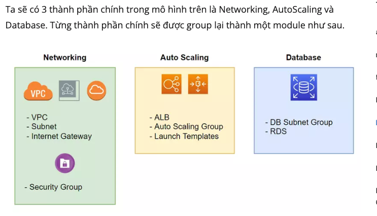
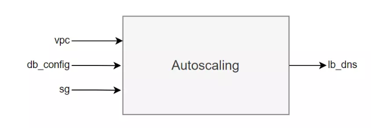
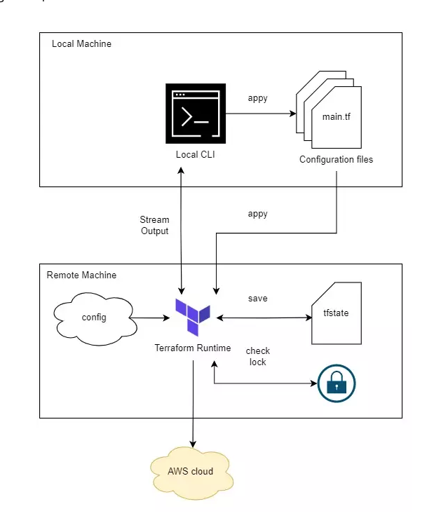
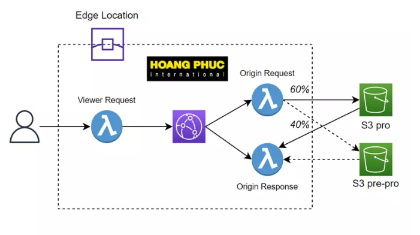
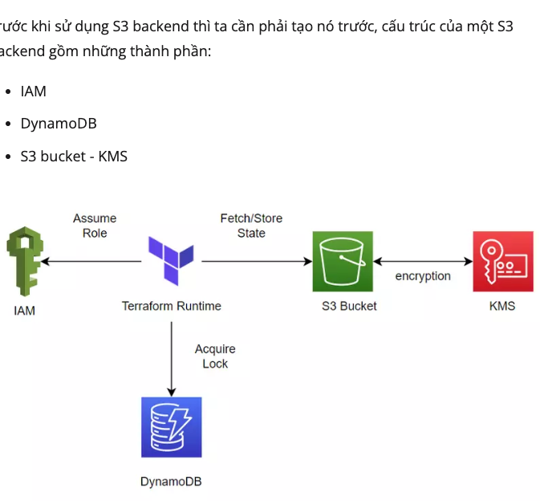

# terraform-aws01
export TF_VAR_access_key= enteryourkey

export TF_VAR_secret_key= enteryourkey

```
terraform init  // command is used to initialize a working directory containing Terraform configuration files. first time only
terraform plan  // verified code
terraform plan -parallelism=m /// m = 2 tang toc do plan
$ terraform plan -out plan.out
$ terraform show -json plan.out > plan.json   // luu ket qua plan

```

 terraform plan -out plan.out
 terraform apply "plan.out"   /// chay lenh apply voi ket qua da luu o tren 


terraform apply // play code
- terraform.tfsate ---> sinh ra khi chay apply ---> show nhung resource duoc tao

terraform destroy  // delete code
- terraform.tfsate ---> sinh ra khi chay apply ---> show nhung resource duoc tao  ---> check noi dung 2 file khac nhau khi apply & destroy

Data block:

terraform có cung cấp cho ta một block khác dùng để queries và tìm kiếm data trên AWS, block này sẽ giúp ta tạo resource một cách linh hoạt hơn là phải điền cứng giá trị của resource. Ví dụ như ở trên thì trường ami của EC2 ta fix giá trị là ami-09dd2e08d601bff67, để biết được giá trị này thì ta phải lên AWS để kiếm, với lại nếu ta dùng giá trị này thì người khác đọc cũng không biết được giá trị này là thuộc ami loại gì.

example: https://github.com/huannv93/terraform-aws02/blob/main/EC2create.tf
---> khi chay terraform plan van show duoc gia tri get dc tu api aws : 

Terraform will perform the following actions:

  # aws_instance.hello will be created
  + resource "aws_instance" "hello" {
      + ami                                  = "ami-0892d3c7ee96c0bf7"
      ...
    }

Plan: 1 to add, 0 to change, 0 to destroy.

Life cycle : Vong doi cua terraform: 


Create() sẽ được gọi trong quá trình tạo resource, Read() được gọi trong quá trình plan, Update() được gọi trong quá trình cập nhật resource, và Delete() được gọi trong quá trình xóa resource.


-- force approve for terraform : terraform destroy **-auto-approve**
**
Resource drift**
Resource drift là vấn đề khi config resource của ta bị thay đổi bên ngoài terraform, với AWS thì có thể là do ai đó dùng Web Console của AWS để thay đổi config gì đó của resource mà được ta deploy bằng terraform.
Thì khi ta sửa như vậy, thì terraform không có tự động phát hiện và update lại file config terraform của ta nhé, nó không có thần kì như vậy 😂. Mà khi ta chạy câu lệnh apply, nó sẽ phát hiện thay đổi và update lại trường tags mà ta thay đổi ngoài terraform thành giống với tags ta viết trong file config. Bạn chạy câu lệnh plan trước để xem.

Note: Objects have changed outside of Terraform

Và tùy thuộc vào thuộc tính mà ta thay đổi bên ngoài terraform là force new hay normal update thì terraform sẽ thực hiện re-create hay update bình thường cho ta.

Vậy còn nếu ta có một resource đang chạy rất nhiều thứ quan trọng, như là database chẳng hạng, thì khi ta thay đổi một thuộc tính là force new thì DB của ta sẽ bị xóa đi và tạo lại cái mới hay sao? Làm sao ta chấp nhận việc đó được? Để giải quyết vấn đề này thì mình sẽ viết một bài khác để giải thích nhé, tại làm hơi dài

Link research: https://viblo.asia/p/terraform-series-bai-2-life-cycle-cua-mot-resource-trong-terraform-RnB5pOMDlPG


3! **Terraform Series - Bài 3 - Terraform functional programming**

variable.tf
```
variable "instance_type" {
  type = string
  description = "Instance type of the EC2"
}
```
- type kiểu dữ liệu  : string la ky tu vd hello world.... ngoai ra con co cac type khac Basic type: string, number, bool ,,,, Complex type: list(), set(), map(), object(), tuple()

Trong terraform, type number và type bool sẽ được convert thành type string khi cần thiết. Nghĩa là 1 sẽ thành "1", true sẽ thành "true"

- Gán giá trị cho bien variable 
variable.tfvars
instance_type = "t2.micro"

Khi chay apply , default se lay file variable.tfvars de dien gia tri bien , neu muon defiend rieng tung tfvaf thi dung nhu sau
```terraform apply -var-file="production.tfvars" ```
---> production.tfvvars dang duoc chon
+ Validating variables
điều khiện với variables :
```
variable "instance_type" {
  type = string
  description = "Instance type of the EC2"

  validation {
    condition = contains(["t2.micro", "t3.small"], var.instance_type)
    error_message = "Value not allow."
  }
}
```

- **Output**
```
...

output "ec2" {
  value = {
    public_ip = aws_instance.hello.public_ip
  }
}
```


- **Count parameter**
---> muc dich: vi du can tao 1000 EC2 cung luc
```
provider "aws" {
  region = "us-west-2"
}

data "aws_ami" "ubuntu" {
  most_recent = true

  filter {
    name   = "name"
    values = ["ubuntu/images/hvm-ssd/ubuntu-focal-20.04-amd64-server-*"]
  }

  owners = ["099720109477"]
}

resource "aws_instance" "hello" {
  count         = 5
  ami           = data.aws_ami.ubuntu.id
  instance_type = var.instance_type
}

output "ec2" {
  value = {
    public_ip1 = aws_instance.hello[0].public_ip
    public_ip2 = aws_instance.hello[1].public_ip
    public_ip3 = aws_instance.hello[2].public_ip
    public_ip4 = aws_instance.hello[3].public_ip
    public_ip5 = aws_instance.hello[4].public_ip
  }
}
```

- **For expressions**
For cho phép ta duyệt qua một list, cú pháp của lệnh for như sau:

Ta sẽ dùng for để rút gọn phần output IP của EC2. Cập nhật lại file main.tf
```
...

resource "aws_instance" "hello" {
  count         = 5
  ami           = data.aws_ami.ubuntu.id
  instance_type = var.instance_type
}

output "ec2" {
  value = {
    public_ip = [ for v in aws_instance.hello : v.public_ip ]
  }
}
```
- **Format function**
Hàm format sẽ giúp ta nối chuỗi theo dạng ta muốn, cập nhật output lại như sau:

```
...

resource "aws_instance" "hello" {
  count         = 5
  ami           = data.aws_ami.ubuntu.id
  instance_type = var.instance_type
}

output "ec2" {
  value = { for i, v in aws_instance.hello : format("public_ip%d", i + 1) => v.public_ip }
}
```


- **File function**
File function sẽ giúp ta tải nội dung của một file nào đó vào bên trong config file của terraform

- **Fileset function**
```{
  "index.html": "index.html",
  "index.css" : "index.css"
}
```
- **Local values**
Không giống như variable block, ta cần khai báo type, thì locals block ta sẽ gán thẳng giá trị cho nó. Ví dụ như sau:
```
locals {
  one = 1
  two = 2
  name = "max"
  flag = true
}
```

Tong ket bai 3: 
Vậy là ta đã tìm hiểu xong về một số cách đơn giản để lập trình được trong terraform. Sử dụng varibale để chứa biến, sử dụng output để show giá trị ra terminal, sử dụng for để duyệt qua mảng, sử dụng locals để lưu giá trị và sử dụng lại nhiều lần. Nếu có thắc mắc hoặc cần giải thích rõ thêm chỗ nào thì các bạn có thể hỏi dưới phần comment. Hẹn gặp các bạn ở bài tiếp theo.

Link : https://viblo.asia/p/terraform-series-bai-3-terraform-functional-programming-4P856GnWKY3


--**Bai4:  Terraform Series - Bài 4 - Terraform Module: Create Virtual Private Cloud on AWS**  ----

- **Provisioning Virtual Private Cloud**
```
provider "aws" {
  region  = "us-west-2"
}

resource "aws_vpc" "vpc" {
  cidr_block           = "10.0.0.0/16"
  enable_dns_hostnames = true

  tags = {
    "Name" = "custom"
  }
}

locals {
  private = ["10.0.1.0/24", "10.0.2.0/24", "10.0.3.0/24"]
  public  = ["10.0.4.0/24", "10.0.5.0/24", "10.0.6.0/24"]
  zone    = ["us-west-2a", "us-west-2b", "us-west-2c"]
}

resource "aws_subnet" "private_subnet" {
  count = length(local.private)

  vpc_id            = aws_vpc.vpc.id
  cidr_block        = local.private[count.index]
  availability_zone = local.zone[count.index % length(local.zone)]

  tags = {
    "Name" = "private-subnet"
  }
}

resource "aws_subnet" "public_subnet" {
  count = length(local.public)

  vpc_id            = aws_vpc.vpc.id
  cidr_block        = local.public[count.index]
  availability_zone = local.zone[count.index % length(local.zone)]

  tags = {
    "Name" = "public-subnet"
  }
}

resource "aws_internet_gateway" "ig" {
  vpc_id = aws_vpc.vpc.id

  tags = {
    "Name" = "custom"
  }
}

resource "aws_route_table" "public" {
  vpc_id = aws_vpc.vpc.id

  route {
    cidr_block = "0.0.0.0/0"
    gateway_id = aws_internet_gateway.ig.id
  }

  tags = {
    "Name" = "public"
  }
}

resource "aws_route_table_association" "public_association" {
  for_each       = { for k, v in aws_subnet.public_subnet : k => v }
  subnet_id      = each.value.id
  route_table_id = aws_route_table.public.id
}

resource "aws_eip" "nat" {
  vpc = true
}

resource "aws_nat_gateway" "public" {
  depends_on = [aws_internet_gateway.ig]

  allocation_id = aws_eip.nat.id
  subnet_id     = aws_subnet.public_subnet[0].id

  tags = {
    Name = "Public NAT"
  }
}

resource "aws_route_table" "private" {
  vpc_id = aws_vpc.vpc.id

  route {
    cidr_block = "0.0.0.0/0"
    gateway_id = aws_nat_gateway.public.id
  }

  tags = {
    "Name" = "private"
  }
}

resource "aws_route_table_association" "public_private" {
  for_each       = { for k, v in aws_subnet.private_subnet : k => v }
  subnet_id      = each.value.id
  route_table_id = aws_route_table.private.id
}
```

```
terraform apply -auto-approve

terraform destroy -auto-approve

```


- **Terraform Module**
Một module cơ bản sẽ gồm 3 file sau đây:
.
├── main.tf
└── vpc
    ├── main.tf
    ├── outputs.tf
    └── variables.tf


main.tf chứa code.
variables.tf chứa input vào của module.
outputs.tf chưa giá trị đầu ra của module.

Ngoài ra còn một vài file khác mà không bắt buộc là providers.tf, versions.tf
// thuong se co file variables.tfvar de truyen gia tri theo tung product ( dev, staging, production...)  ./dev/dev.tfvar , ./product/p1.tfvar


main.tf of 1 module:
```
module <module_name> {
  source = <source>
  version = <version>

  input_one = <input_one>
  input_two = <input_two>
}
```

./main.tf
```
provider "aws" {
  region = "us-west-2"
}

module "vpc" {
  source = "./vpc"

  vpc_cidr_block    = "10.0.0.0/16"
  private_subnet    = ["10.0.1.0/24", "10.0.2.0/24", "10.0.3.0/24"]
  public_subnet     = ["10.0.4.0/24", "10.0.5.0/24", "10.0.6.0/24"]
  availability_zone = ["us-west-2a", "us-west-2b", "us-west-2c"]
}
```

./vpc/main.tf 

```
resource "aws_vpc" "vpc" {
  cidr_block           = var.vpc_cidr_block
  enable_dns_hostnames = true

  tags = {
    "Name" = "custom"
  }
}

resource "aws_subnet" "private_subnet" {
  count = length(var.private_subnet)

  vpc_id            = aws_vpc.vpc.id
  cidr_block        = var.private_subnet[count.index]
  availability_zone = var.availability_zone[count.index % length(var.availability_zone)]

  tags = {
    "Name" = "private-subnet"
  }
}

resource "aws_subnet" "public_subnet" {
  count = length(var.public_subnet)

  vpc_id            = aws_vpc.vpc.id
  cidr_block        = var.public_subnet[count.index]
  availability_zone = var.availability_zone[count.index % length(var.availability_zone)]

  tags = {
    "Name" = "public-subnet"
  }
}

resource "aws_internet_gateway" "ig" {
  vpc_id = aws_vpc.vpc.id

  tags = {
    "Name" = "custom"
  }
}

resource "aws_route_table" "public" {
  vpc_id = aws_vpc.vpc.id

  route {
    cidr_block = "0.0.0.0/0"
    gateway_id = aws_internet_gateway.ig.id
  }

  tags = {
    "Name" = "public"
  }
}

resource "aws_route_table_association" "public_association" {
  for_each       = { for k, v in aws_subnet.public_subnet : k => v }
  subnet_id      = each.value.id
  route_table_id = aws_route_table.public.id
}

resource "aws_eip" "nat" {
  vpc = true
}

resource "aws_nat_gateway" "public" {
  depends_on = [aws_internet_gateway.ig]

  allocation_id = aws_eip.nat.id
  subnet_id     = aws_subnet.public_subnet[0].id

  tags = {
    Name = "Public NAT"
  }
}

resource "aws_route_table" "private" {
  vpc_id = aws_vpc.vpc.id

  route {
    cidr_block = "0.0.0.0/0"
    gateway_id = aws_nat_gateway.public.id
  }

  tags = {
    "Name" = "private"
  }
}

resource "aws_route_table_association" "public_private" {
  for_each       = { for k, v in aws_subnet.private_subnet : k => v }
  subnet_id      = each.value.id
  route_table_id = aws_route_table.private.id
}
```

./vpc/variables.tf

```
variable "vpc_cidr_block" {
  type    = string
  default = "10.0.0.0/16"
}

variable "private_subnet" {
  type    = list(string)
}

variable "public_subnet" {
  type    = list(string)
}

variable "availability_zone" {
  type    = list(string)
}
```


-   **Common module**
Ở trên ta viết với mục đích là tìm hiểu, khi làm thực tế cho môi trường production, ta nên xài những module có sẵn trên mạng, họ viết sẽ kĩ hơn nhiều và sẽ có rất nhiều chức năng và use case hơn so với ta phải tự viết. Ví dụ vpc module ở trên, ta có thể sử dụng một module có sẵn là terraform-aws-modules/vpc/aws.
HASCICOP has document for create AWS: https://registry.terraform.io/modules/terraform-aws-modules/vpc/aws/latest

- Tong ket bai 4: 
Vậy là ta đã tìm hiểu xong cách viết code từ đầu và sau đó tổ chức code lại thành module, cách publish một module lên trên mạng, cách sử dụng module có sẵn. Module giúp ta sử dụng code có sẵn và tránh phải viết code đi code lại nhiều lần. Nếu có thắc mắc hoặc cần giải thích rõ thêm chỗ nào thì các bạn có thể hỏi dưới phần comment. Hẹn gặp mọi người ở bài tiếp theo. Bài tiếp theo ta cũng nói tiếp về module mà sẽ đi sâu hơn chút, ta sẽ làm ví dụ tạo VPC, Autoscaling Group và Load Balancer trên AWS.

- https://viblo.asia/p/terraform-series-bai-4-terraform-module-create-virtual-private-cloud-on-aws-ORNZqp2MK0n

--**Bai5:  Terraform Series - Module In Depth: Create Multi-Tier Application**  ----


```
.
├── main.tf
└── modules
├── autoscaling
│   ├── main.tf
│   ├── outputs.tf
│   └── variables.tf
├── database
│   ├── main.tf
│   ├── outputs.tf
│   └── variables.tf
└── networking
      ├── main.tf
      ├── outputs.tf
      └── variables.tf
      
```


 Ở bài này chúng ta sẽ tìm hiểu sâu hơn về module thông qua việc xây dựng hạ tầng cho một ứng dụng Multi-Tier bao gồm AWS Application Load Balancer + Auto Scaling Group + Relational Database Service
 
 

**Networking Module**

Output value
Để truy cập giá trị của một module, ta dùng systax sau module.<name>.<output_value>, ví dụ để truy cập giá trị lb_sg id của networking module.
``
module.networking.sg.lb
``
``module "networking" {
source = "./modules/networking"
}

module.networking.sg.lb
``
**Database Module**


Ở trên AWS, khi ta tạo RDS, yêu cầu ta cần phải có một **subnet groups** trước, rồi RDS mới được deploy lên trên subnet group đó.

Có một điểm ta cần nói là ở file khai báo biến của database module, hai giá trị là vpc với sg, ta khai báo type là any.

Khi ta muốn truyền một giá trị mà ta không biết nó thuộc loại dữ liệu nào, thì ta sẽ khai báo kiểu dữ của nó là any, ở trên vì biến vpc là any nên ta mới có thể truyền nguyên giá trị của module vpc vào database module được.

```
variable "vpc" {
type = any
}

variable "sg" {
type = any
}
```

**Autoscaling Module**

- 


-----**BAI06  Terraform Series - Bài 6 - Terraform Backend: Understand Backend**----

link: https://viblo.asia/p/terraform-series-bai-6-terraform-backend-understand-backend-924lJRr6lPM

Understand Backend
Khi chúng ta làm việc với Terraform, nếu chỉ làm có một mình ta làm thì mọi chuyện rất yên ổn và không có gì xảy ra, nhưng nếu có thêm một người khác tham gia vào để viết terraform file cùng với ta, thì sẽ có rất nhiều vấn đề xảy ra.
- làm sao ta có thể share source code với nhau,
- và làm sao chúng ta share terraform state file với nhau
- Vấn đề thứ hai là nếu cùng lúc có cả hai người chạy apply, thì hạ tầng của ta sẽ thế nào?

  Để giải quyết những vấn đề trên thì ta sẽ sử dụng một feature của terraform là Backend

- Trong terraform sẽ có ba loại backend như sau:
Local backend.
Standard backend.
Remote backend (enhanced backend).

**Local backend**
Only local. phu hop voi su dung 1 minh 1 project

**Standard backend**
Ở loại backend này thì Terraform runtime vẫn được thực thi ở máy local, nhưng sau khi nó chạy xong thì kết quả của nó sẽ được lưu ở một nơi khác (remote state file). Nơi ta dùng để lưu trữ state file có thể là AWS S3, GCP Cloud Storage, ...

Ko bảo mật vì vẫn lưu key dưới local. 

**Remote backend**




Ngoài việc lựa chọn backend cho terraform, khi làm thực tế ta cũng thường phải xây dựng CI/CD cho một terraform project. Để làm CI/CD cho terraform cũng khá mất thời gian nên để tiết kiệm thời gian ta có thể xài một platform có sẵn của Terraform là Terraform Cloud.

Ko cần tạo CI/CD thêm chop terraform mà dùng trực tiếp terraform cloud.
Khi xài Terraform Cloud thì những thứ ta cần làm rất đơn giản, chỉ cần viết code và push lên github, Terraform Cloud sẽ pull code xuống và chạy cho ta.

Vậy là ta đã tìm hiểu xong về lý thuyết của Terraform Backend, ở trên là ba loại backend Terraform hỗ trợ khi mình viết bài này, local backend thích hợp khi ta làm dự án một mình, standard và remote backend phù hợp khi ta làm theo team. Tùy vào trường hợp thì ta sẽ xài loại phù hợp. Nếu có thắc mắc hoặc cần giải thích rõ thêm chỗ nào thì các bạn có thể hỏi dưới phần comment. Ở bài tiếp theo ta nói về cách config và triển khai Terraform dùng S3 Standard Backend.


-----**BAI07  Terraform Series - Bài 7 - Terraform Backend: S3 Standard Backend**----




- **Developing an S3 backend**


Từng thành phần trên sẽ được sử dụng như sau:

IAM được sử dụng để terraform assume role, để terraform có quyền ghi vào dynamodb table và fetch/store state vào bên trong S3.
Dynamodb được terraform dùng để ghi lock key của một process vào bên trong nó, vì dynamodb có tốc độ đọc và ghi nhanh tới mức milisecond nên nó rất thích hợp để lock state của một process.
S3 bucket dùng để lưu trữ state khi terraform chạy xong, KMS được S3 sử dụng để mã hóa dữ liệu state khi nó được lưu vào bên trong S3.


--- **BAI08- Terraform Series - Bài 8 - Terraform Backend: Remote Backend with Terraform Cloud**

link: https://viblo.asia/p/terraform-series-bai-8-terraform-backend-remote-backend-with-terraform-cloud-vyDZOR0QKwj


Terraform Cloud có ba cách sử dụng là:

Version control workflow.
CLI-driven workflow.
API-driven workflow.
Ta sẽ sử dụng CLI-driven workflow cho remote backend, Version control workflow cho CI/CD.

Khi câu lệnh apply chạy xong thì lúc này state file của ta sẽ được lưu ở remote, bạn có thể kiểm tra ở trên terraform cloud, bấm qua tab State.
**Quan trọng:** lưu ý một điều là khi ta chạy các câu lệnh của terraform với remote backend, thì terraform runtime sẽ không chạy ở máy của ta mà sẽ chạy ở remote server, và nó sẽ stream kết quả về máy local của ta. Do đó, khi bạn đang chạy mà bạn có bấm Ctrl + C để tắt quá trình chạy thì nó chỉ tắt stream thôi, còn runtime ở remote server của ta vẫn chạy bình thường.

--- **Bai 09  : Terraform Series - Bài 9 - CI/CD with Terraform Cloud and Zero-downtime deployments**  ----

**Zero-downtime deployment**

Để tránh downtime trong trường hợp này, terraform cung cấp cho một meta argument tên là create_before_destroy.

            ```Use create_before_destroy
            resource "aws_instance" "ansible_server" {
            ami           = data.aws_ami.ami.id
            instance_type = "t3.small"
            
            lifecycle {
            create_before_destroy = true
            }
            }
            ```

**Considering when use create_before_destroy**
Thuộc tính create_before_destroy có thể rất thuận tiện, nhưng ta cần nên lưu ý một điều là không phải lúc nào ta cũng có thể sử dụng thuộc tính này cho resource được, vì sẽ có một vài resource bị conflict.

**No zero-downtime deployment**

dịch vụ database của AWS là RDS, khi ta thay đổi instance_type của nó thì ta không thể sử dụng thuộc tính create_before_destroy để thực hiện zero-downtime deployment được, vì lúc này RDS của ta nó đâu có bị xóa và tạo lại đâu, nó chỉ cập nhật lại instance_type và bị downtime mà thôi.

Tất nhiên là cũng sẽ có cách để triển khai zero-downtime deployment cho database được, nhưng quá trình thực hiện sẽ rất phức tạp và cần kết hợp nhiều công cụ khác nhau chứ không thể chỉ dùng Terraform được.


--- **Bai10 Terraform Series - Bài 10 - Terraform Blue/Green deployments**  ----

Chào các bạn tới với series về Terraform, ở bài trước chúng ta tìm hiểu về Zero-downtime deployments, nhưng ta chỉ mới tìm hiểu cách thực hiện ZDD cho một resource đơn giản là EC2. Ở bài này ta sẽ tìm hiểu cách thực hiện ZDD cho một resource phức tạp hơn là Autoscaling Group bằng phương pháp Blue/Green deployments.

**Blue/Green deployments**
Để thực hiện Blue/Green deployment thì ứng dụng của ta sẽ có hai môi trường production, một thằng sẽ được gọi là Blue và một thằng được gọi là Green, chỉ một trong hai thằng này sẽ ở trạng thái live để nhận request của user, còn một thằng con lại sẽ ở trạng thái idle (không làm việc).

**Blue/Green deployments with Autoscaling Group**


**Base resource and Application resource**

- base resource là các thành phần được sử dụng chung và sẽ không thay đổi nhiều trong quá trình deploy
- application resource có thể thay đổi nhiều trong quá trình deploy, thậm chí có thể xóa nó luôn và tạo lại thằng mới mà không ảnh hưởng gì tới hệ thống của ta.
Đối với các resource dùng để lưu dữ liệu như là database, thì để chuyển đổi database giữa các môi trường là một vấn đề rất phức tạp nên thông thường ta sẽ xếp database vào trong base resource


**Implement**

--- **BAI11 Terraform Series - Bài 11 - Terraform A/B Testing Deployment** ---

link : https://viblo.asia/p/terraform-series-bai-11-terraform-ab-testing-deployment-1Je5EAWj5nL


**A/B Testing Deployment**

Đây là phương pháp triển khai mà cho phép ứng dụng của ta sẽ có nhiều version cùng một lúc, và người dùng sẽ được redirect tới một version cụ thể dựa vào một flag gì đó mà ta chỉ định

**A/B Testing Deployment with CloudFront and Lambda@Edge**


read more: **https://viblo.asia/p/gioi-thieu-ve-aws-lambda-mot-dich-vu-cua-amazon-l5XRBJD4RqPe**

**Config Lambda@Edge and CloudFront Function.**
nhúng một cookies vào trong browser của client, cookie mà ta sẽ nhúng có giá trị là **X-Redirect-Flag=Pro** hoặc **X-Redirect-Flag=Pre-Pro**
Sau đó nếu client gửi request lên trang của ta thì ta sẽ kiểm ta là nếu trong headers của client có cookie với giá trị là X-Redirect-Flag=Pro thì ta sẽ chuyển nó qua S3 pro hoặc ngược lại.

**Hiện tại AWS chỉ hỗ trợ các Lambda nào tạo ở region us-east-1 mới có thể deploy thành Lambda@Edge, nên ta phải tạo Lambda ở region us-east-1.**

Lambda@Edge là gì?
Lambda@Edge cho phép bạn chạy các hàm của Lamda để customize nội dung mà CloudFront deliver tới người dùng, cụ thể hơn 1 chút nó cho phép chạy các function ở AWS location gần với người dùng nhất từ đó nâng cao tốc độ vận chuyển content.
Link: https://viblo.asia/p/tim-hieu-ve-lambdaedge-aWj53powK6m


--- **BAI 12 Terraform Series - Bài 12 - Ansible with Terraform**  ---

**Provisioners**
Provisioners có hai loại là:

local-exec: dùng để chạy script ở dưới máy local mà Terraform đang chạy, ta sẽ dùng này để chạy Ansible.
remote-exec: dùng để chạy script ở máy remote. Ví dụ ta tạo EC2 xong thì ta sẽ dùng remote-exec để chạy đoạn script ở trên con EC2 mới tạo.

Nếu ta EC2 của ta chỉ cần cấu hình đơn giản thì ta chỉ cần dùng remote-exec để chạy mấy câu CLI đơn giản như vậy là được, nhưng nếu EC2 của ta cần cấu hình phức tạp hơn nhiều thì ta không thể chỉ sử dụng mấy câu CLI được, mà ta cần dùng công cụ gọi là Configuration Management.

**Ansible**
Khi ta dùng Terraform, ta chỉ sử dụng nó cho việc provisioning hạ tầng, còn việc cấu hình hạ tầng thì ta không nên dùng Terraform vì đó không phải lĩnh vực của nó, mà ta nên dùng configuration management. Trong những công cụ configuration management thì có lẽ Ansible là được sử dụng rộng rãi nhất. Mô hình phổ biến như sau.


Note: Ko hiểu vì sao phải cài ansible lên host remote !
